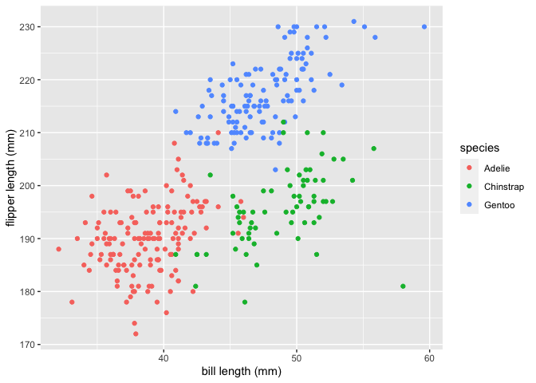

Homework 1
================
Yiming Zhao

This is my solution for HW1

``` r
library(tidyverse)
```

    ## ── Attaching packages ────────────────────────────────────────────────────────────────────────────────── tidyverse 1.3.0 ──

    ## ✓ ggplot2 3.3.2     ✓ purrr   0.3.4
    ## ✓ tibble  3.0.1     ✓ dplyr   1.0.2
    ## ✓ tidyr   1.1.2     ✓ stringr 1.4.0
    ## ✓ readr   1.3.1     ✓ forcats 0.5.0

    ## ── Conflicts ───────────────────────────────────────────────────────────────────────────────────── tidyverse_conflicts() ──
    ## x dplyr::filter() masks stats::filter()
    ## x dplyr::lag()    masks stats::lag()

``` r
data("penguins", package = "palmerpenguins")
```

## Problem 1

###### Create a data frame with the specified elements.

``` r
prob1_df = 
  tibble(
    samp = rnorm(10),
    samp_gt_0 = samp > 0,
    char_vec = c("a", "b", "c", "d", "e", "f", "g", "h", "i","j"),
    factor_vec = factor(c("low", "low", "low", "mod", "mod", "mod", "mod", "high", "high", "high"))
  )
```

###### Take the mean of each variable in my data frame.

``` r
mean(pull(prob1_df, samp))
```

    ## [1] 0.043159

``` r
mean(pull(prob1_df, samp_gt_0))
```

    ## [1] 0.5

``` r
mean(pull(prob1_df, char_vec))
```

    ## Warning in mean.default(pull(prob1_df, char_vec)): argument is not numeric or
    ## logical: returning NA

    ## [1] NA

``` r
mean(pull(prob1_df, factor_vec))
```

    ## Warning in mean.default(pull(prob1_df, factor_vec)): argument is not numeric or
    ## logical: returning NA

    ## [1] NA

###### I can take the mean of numbers and logical vectors but not character or factor vectors.

``` r
as.numeric(pull(prob1_df, samp))
as.numeric(pull(prob1_df, samp_gt_0))
as.numeric(pull(prob1_df, char_vec))
```

    ## Warning: NAs introduced by coercion

``` r
as.numeric(pull(prob1_df, factor_vec))
```

###### I can convert logical and factor into number, but not character. This is because the logical vectors:True and false, are considered as number 1 and 0 in the R. And Factors are used to categorize the data and store it on multiple levels, the levels can be converted into numbers.

###### These conversions help explain why the mean of numbers and logical vectors can be taken but not character or factor vectors.

``` r
as.numeric(pull(prob1_df, samp_gt_0)) * pull(prob1_df, samp)
```

    ##  [1] 0.8001574 0.8200328 0.2653156 0.0000000 1.0303193 0.0000000 0.0000000
    ##  [8] 0.0000000 0.7495562 0.0000000

``` r
as.factor(pull(prob1_df, samp_gt_0)) * pull(prob1_df, samp)
```

    ## Warning in Ops.factor(as.factor(pull(prob1_df, samp_gt_0)), pull(prob1_df, : '*'
    ## not meaningful for factors

    ##  [1] NA NA NA NA NA NA NA NA NA NA

``` r
as.numeric(as.factor(pull(prob1_df, samp_gt_0))) * pull(prob1_df, samp)
```

    ##  [1]  1.6003148  1.6400657  0.5306311 -0.5581205  2.0606386 -0.2631934
    ##  [7] -0.5127179 -1.5394073  1.4991123 -0.3603522

## Problem 2

The variables in penguins dataset includes: bill\_depth\_mm,
bill\_length\_mm, body\_mass\_g, flipper\_length\_mm, island, sex,
species, year  
The species for penguins in the penguins dataset includes: Adelie,
Chinstrap, Gentoo  
The range year of dataset is 2007, 2009  
The range of bill length of penguins in the dataset is 32.1, 59.6 mm  
The penguins data frame has 344 rows. The penguins data frame has 8
columns.  
The mean flipper length for penguins in this data frame is 200.9152047
mm

``` r
plot_df = tibble(
  bill_length = penguins$bill_length_mm, 
  flipper_length = penguins$flipper_length_mm,
  species = penguins$species
)

ggplot(plot_df, aes(x = bill_length, y = flipper_length, color = species)) + 
  geom_point() + 
  xlab("bill length (mm)") +
  ylab("flipper length (mm)")
```

    ## Warning: Removed 2 rows containing missing values (geom_point).

<!-- -->
